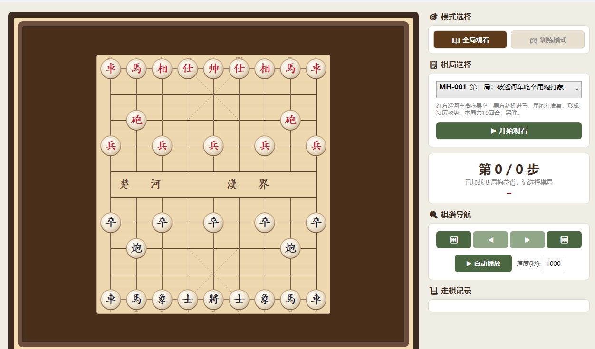

# 梅花谱象棋

中国传统象棋桌面应用，内置《梅花谱》29 局经典棋谱，支持棋谱观看和残局训练两种模式。

## 功能

- **全局观看** — 自动播放或手动翻阅经典对局，含走棋记录和吃子统计
- **训练模式** — 隐去正确走法，由你来走，走对才继续；支持提示和悔棋
- **主题切换** — 靛蓝茉莉 / 竹青翠微 / 朱砂暖煦 三套配色一键切换
- **检查更新** — 连接 GitHub 检测最新版本，发现新版可跳转下载
- **棋盘渲染** — 手工绘制棋子渐变、金属包边、内圈金线，自适应窗口大小
- **现代化界面** — 圆角卡片、柔和阴影、多彩按钮、彩色区域指示

## 截图



## 技术栈

| 层 | 技术 |
|---|------|
| UI | WPF (.NET 10) |
| 架构 | MVVM (CommunityToolkit.Mvvm) |
| DI | Microsoft.Extensions.DependencyInjection |
| 更新 | GitHub Releases API |
| 棋局数据 | JSON 内嵌资源 |

## 项目结构

```
src/
├── MeiHuaPuChess.App/          # WPF 界面
│   ├── Views/                  # 棋盘控件、更新弹窗
│   ├── ViewModels/             # MVVM ViewModel
│   ├── Services/               # 更新检查服务
│   ├── Themes/                 # 主题配色定义
│   ├── Converters/             # 值转换器
│   └── Resources/              # 图标资源
├── MeiHuaPuChess.Core/         # 核心引擎
│   ├── Engine/                 # 走棋逻辑、将军检测、合法性校验
│   ├── Models/                 # 棋盘/棋子/棋谱数据模型
│   ├── Enums/                  # 枚举定义
│   ├── MeiHuaPu/               # 梅花谱专用引擎
│   └── Services/               # 游戏服务
├── MeiHuaPuChess.Data/         # 数据加载
│   └── meiHuaPu_records.json   # 梅花谱 29 局棋谱
└── tests/
    └── MeiHuaPuChess.RegressionTests/  # 回归测试
```

## 运行

需要 [.NET 10 SDK](https://dotnet.microsoft.com/download/dotnet/10.0)。

```bash
git clone https://github.com/2338604753/MeiHuaPuChess.git
cd MeiHuaPuChess
dotnet run --project src/MeiHuaPuChess.App
```

## 下载

前往 [Releases](https://github.com/2338604753/MeiHuaPuChess/releases) 下载最新版本，解压双击 `MeiHuaPuChess.App.exe` 即可运行（无需安装 .NET 运行时）。

## License

MIT
